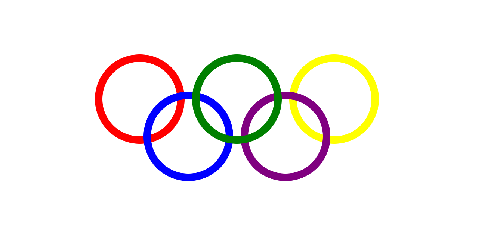

## div画五环且居中


```html
<!DOCTYPE html>
<html lang="en">
<head>
  <meta charset="UTF-8">
  <meta name="viewport" content="width=device-width, initial-scale=1.0">
  <title>div话五环且居中</title>
  <style type="text/css">

    * {
      margin: 0;
      padding: 0;
    }

    .plat{
      position: absolute;
      left: 50%;
      top: 50%;
      margin-left: -190px;
      margin-top: -85px;
      width: 380px;
      height: 170px;
    }
  
    .circle1,
    .circle2, 
    .circle3, 
    .circle4, 
    .circle5 {
      position: absolute;
      width: 100px;
      height: 100px;
      border: 10px solid black;
      border-radius: 50%;
    }
    .circle1 {
      border-color: red;
      left: 0px;
      top: 0px;
    }
    .circle2{
      border-color: green;
      left:130px;
      top: 0px;
      z-index: 3;
    }
    .circle3 {
      border-color: yellow;
      left: 260px;
      top: 0px;
    }
    .circle4 {
      border-color: blue;
      left: 65px;
      top: 50px;
    }
    .circle5 {
      border-color: purple;
      left:195px;
      top: 50px;
    }
  </style>
</head>
<body>
  <div class="plat">
    <div class="circle1"></div>
    <div class="circle2"></div>
    <div class="circle3"></div>
    <div class="circle4"></div>
    <div class="circle5"></div>
  </div>
</body>
</html>
```


