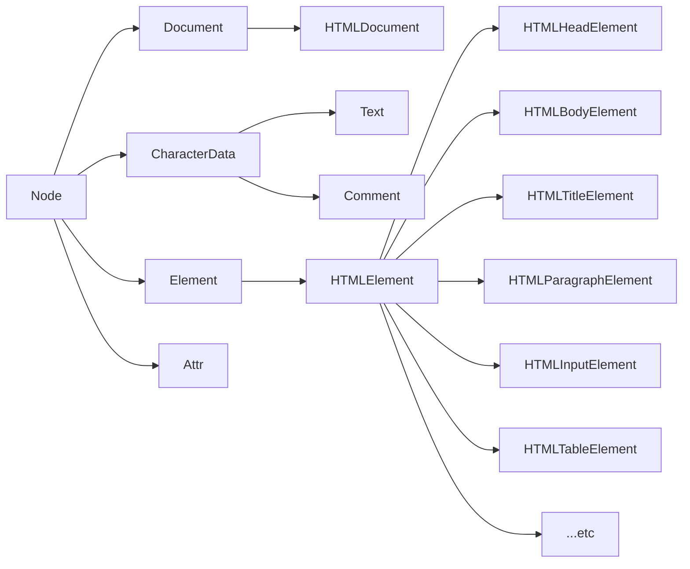

## DOM继承树和DOM基本操作

**DOM结构树**

继承关系；document --> HTMLDocument.prototype --> Document.prototype




**DOM基本操作**——查

- getElementById方法定义在Document.prototype上，即Element节点上不能使用。

- getElementsByName方法定义在HTMLDocument.prototype上，即非html中的document不能使用（xml document, Element）

- getElementsByTagName方法定义在Document .prototype和Element.prototype上

- HTMLDocument.prototype定义了一些常用的属性，body,head分别指代HTML文档中的body和head标签

  ```javascript
  document.documentElement -- HTML
  document.head -- head
  document.body -- body
  ```

- Document.prototype上定义了documentElement属性，指代文档的根元素，在HTML文档中，它总是指代HTML元素

- getElementsByClassName、querySelectorAll、querySelector在Document.prototype和Element.prototype类中均有定义。


封装函数，返回元素的第N层祖先元素节点：

```javascript
function retParent(elem, n) {
    while (elem && n) {
        elem = elem.parentElement;
        n--;
    }
    return elem;
}
var elem = document.getElementsByTagName("i")[0];

var result = retParent(elem, 10);
console.log(result);
```

编辑函数，封装myChildren功能，解决以前部分浏览器的兼容性问题

```javascript
Element.prototype.myChildren = function() {
    var child = this.children;
    var len = child.length;
    var arr = [];
    for (var i = 0; i < len; i++) {
        if (child[i].nodeType == 1) {
            arr.push(child[i]);
        }
    }
    return arr;
}
var div = document.getElementsByTagName('div')[0];
console.log(div.myChildren());
```

自己封装hasChildren()方法，不可用children属性

```javascript
Element.prototype.hasChildren = function() {
    var child = this.children;
    var len = child.length;
    var arr = [];
    for (var i = 0; i < len; i++) {
        if (child[i].nodeType == 1) {
            return true;
        }
    }
    return false;
}
var div = document.getElementsByTagName('div')[0];
console.log(div.hasChildren());
```

封装函数，返回元素e的第n个兄弟元素节点，n为正，返回后面的兄弟元素节点，n为负，返回前面的，n为0，返回自己。

```javascript
function retSibling(e, n) {
    while (e && n) {
        if (n > 0) {
            if (e.nextElementSibling) {
                e = e.nextElementSibling;
            } else {
                for (e = e.nextSibling; e && e.nodeType != 1; e = e.nextSibling); // for循环也可以这么写
            }
            n--;
        } else {
            if (e.previousElementSibling) {
                e = e.previousElementSibling;
            } else {
                for (e = e.previousSibling; e && e.nodeType != 1; e = e.previousSibling); // for循环也可以这么写
            }
            n++;
        }
    }
    return e;
}

var strong = document.getElementsByTagName('strong')[0];
console.log(retSibling(strong, -1));
```


**DOM基本操作**——增

- document.createElement()

  ```javascript
  var strong = document.createElement('strong');
  document.body.append(strong);
  strong.innerText = "strong";
  ```

- document.createTextNode()

  ```javascript
  var strong = document.createTextNode('baoshan');
  document.body.append(strong);
  ```

- document.createComment()

  ```javascript
  var comment = document.createComment('baoshan');
  document.body.append(comment);
  ```

- document.createDocumentFragment()

**DOM基本操作**——插

- PARENTNODE.appendChild()   // 剪切操作
- PARENTNODE.insertBefore(a, b) // insert a before b

**DOM基本操作**——删

- parent.removeChild() // 谋杀（他杀）
- child.remove()  // 自杀

**DOM基本操作**——替换

- parent.replaceChild(new, origin)  // new 把 origin替换掉


DOM基本操作

Element节点的一些属性

- innerHTML
- innerText(火狐不兼容)/textContent(老版本IE不好使)

Element节点的一些方法

- ele.setAttribute()

  ```javascript
  var div = document.getElementsByTagName('div')[0];
  div.setAttribute('class', 'demo');
  console.log(div);
  ```

- ele.getAttribute();

  ```javascript
  console.log(div.getAttribute('class'));
  ```

  ```javascript
  // 给每个标签增加一个属性this-name，属性值为标签名
  var all = document.getElementsByTagName('*');
  for (var i = 0; i < all.length; i++) {
      all[i].setAttribute('this-name', all[i].nodeName);
  }
  ```

  编写程序实现如下结构

  ```html
  <div class="example">
    <p class="slogan">
      xx真帅！
    </p>
  </div>
  ```

  实现脚本如下：

  ```javascript
  var div = document.createElement('div');
  div.setAttribute('class', "example");
  // div.className = "example";
  document.body.append(div);
  var p = document.createElement('p');
  div.appendChild(p);
  p.setAttribute('class', "slogan");
  p.innerText = "xx真帅！";
  console.log(div);
  ```

改变标签的class有一个简单方法：

```javascript
div.className = "example";
```

